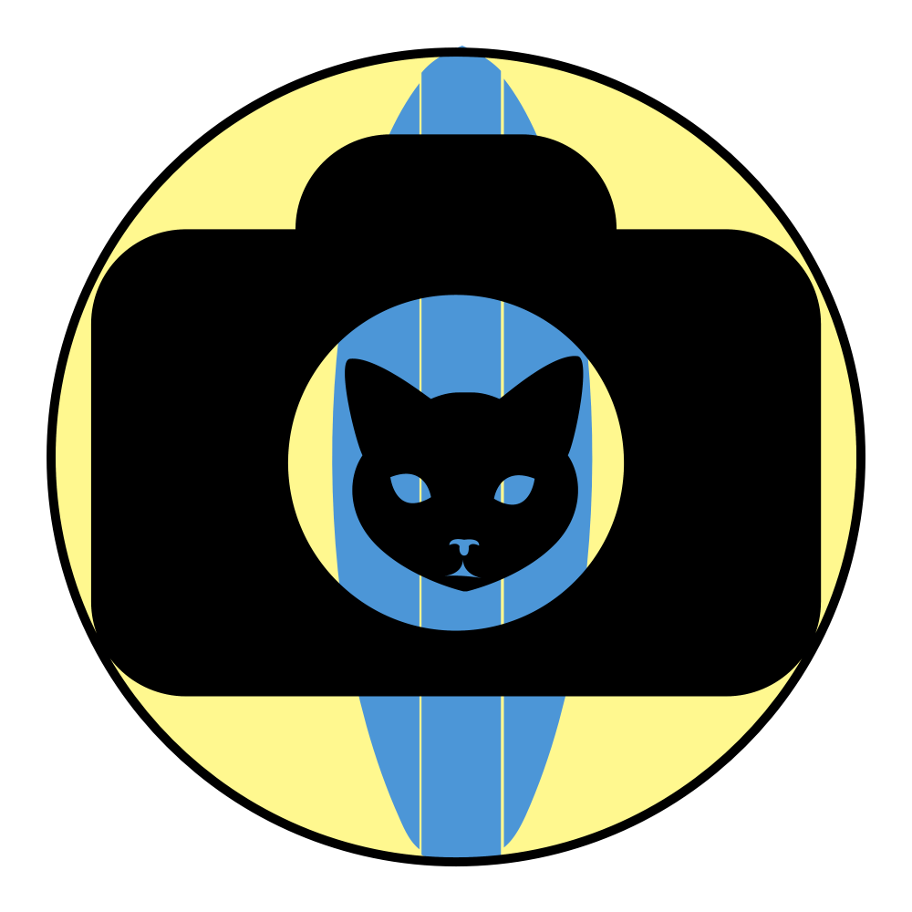

# SurfRCaT: The Surf-camera Remote Calibration Tool #

SurfRCaT is a graphical user interface-driven tool to help you transform pre-exisiting cameras on the United States' coastline
into quantitative coastal monitoring tools without leaving your computer.

More information about SurfRCaT can be found on the [About](https://conlin-matt.github.io/SurfRCaT/about.html) page.

The [Overview](https://conlin-matt.github.io/SurfRCaT/overview.html) page provides an overview of the processes and assumptions of SurfRCaT.

The [Download](https://conlin-matt.github.io/SurfRCaT/download.html) page provides instructions for downloading and/or installing the tool.

Usage tutorials are provided in the [Tutorials](https://conlin-matt.github.io/SurfRCaT/tutorials.html) page. 

The [Extensions](https://conlin-matt.github.io/SurfRCaT/extensions.html) page provides information on extensions of the tool including interfacing output with Python/Matlab and other potential tool applications.

