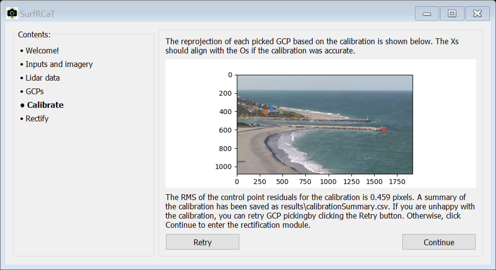
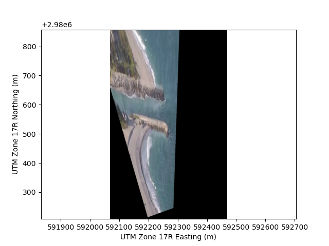
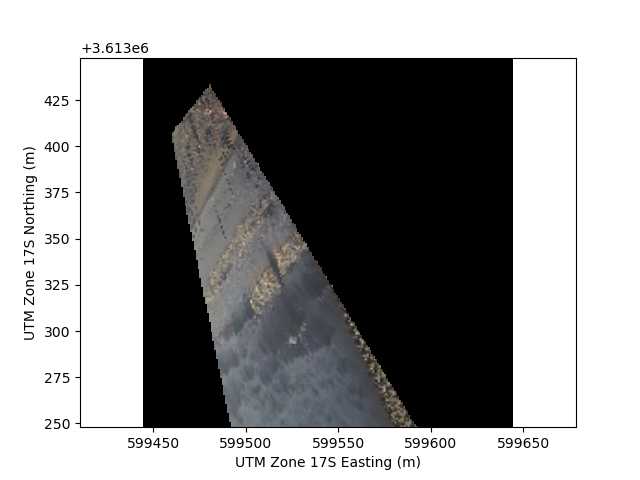
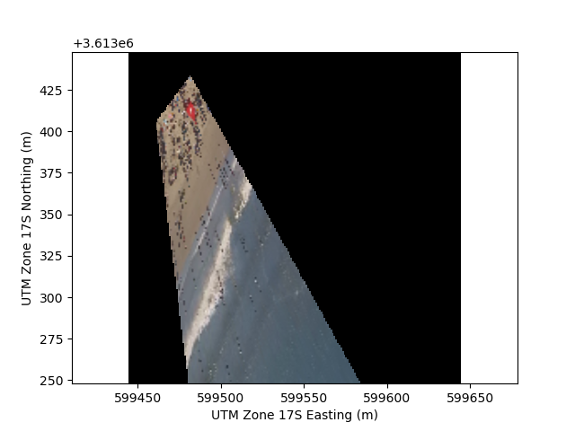

# Tutorial 1- Quantify morphology with a pre-exisiting camera #
In this tutorial, we will calibrate a pre-existing surfcam on the east coast of Florida and rectify some of its imagery in order to extract potentially useful geophysical information. This tutorial is intended to get you familiar with the primary facilities and nuances of SurfRCaT in terms of calibrating 
a camera and then rectifying its imagery for geophysical applications. It is also intented to illustrate many of the considerations for using imagery from
recreational cameras for research-purposes. The video used in this example, from a camera overlooking Jupiter Inlet, FL at approximately 5 pm on March 6 2020, can be downloaded from [here](https://www.dropbox.com/s/gd98xf4o3bhauhg/JupiterTutorial1.mp4?dl=1).

> **NOTE**
>
> Prior permission from the camera owners/operators was obtained to save video from this camera. This is a requirement for working with 
> most pre-existing surfcams. Many are owned by private entities. Once permission is obtained, web-based video streams can be saved locally
> using a programming language or open-source web extensions/tools.							

1. Create a directory called `SurfRCaT_Tutorial1`. Download the video into this directory.
2. Download/install and invoke the tool (see [Download](https://conlin-matt.github.io/SurfRCaT/download.html)).
3. In the Welcome screen, select "Calibrate a surfcam".
4. Browse to and select the `../SurfRCaT_Tutorial1` directory as the working directory. Press Continue.
5. Input the values listed below within the "Any camera" box. Then use the "Browse" button to select the example video file in your
`../SurfRCaT_Tutorial1` directory as the video to use. Leave the "Used saved lidar point cloud?" field as "No". Then press Continue.
   + Name: Jupiter Inlet
   + Camera latitude: 26.93846
   + Camera longitude: -80.07054
   + Elevation: 49.5
   + Azimuth: 350

   > **Note**
   > 
   > These value estimates were obtained via Google Earth, which requires only an initial idea of camera position. Since the precise location/elevation of
   > surfcams is generally unknown, we see this as the best way to obtain these inputs. However,  Google Earth elevation values are generally unreliable-
   > in this example I counted the number of stories of the building that the camera sits atop and used this as the elevation estimate. 

6. The video decimation window will now open. This step allows you to extract frames from the video. We will use one of the frames to complete the remote
GCP extraction. You can enter different decimation rates and click Update to see how many frames will be generated for a given rate. Enter '5' in the Number of Frames field 
to generate 5 images, which will be saved to `../SurfRCaT_Tutorial1/calibration_JupiterTutorial1/frames`. 
We will be able to choose our favorite frame of the 5 in the next window. Press Go.

   > **Note**
   >
   > This camera is not a pan-tilt-zoom (PTZ) camera, however many surfcams are. PTZ cameras periodically change their view between multiple 
   > presets. If working with a PTZ camera, it is a good idea to extract more frames from your video to ensure you obtain frames from the 
   > view that you are interested in. See Tutorial 2 for an example of working with a PTZ camera.

7. Choose your favorite frame by using the arrow buttons. Press Continue when you have found your favorite.
8. The tool will now automatically find airborne lidar datasets that cover the location of this camera. This is a two-step process that takes some time; the tool will 
first search for nearby datasets and then examine those to find covering datasets. Press Continue when the processes finish.
9. The next window will display a table that shows all NOAA lidar datasets that cover the location of this camera, allowing you to select one to use
in the remote-GCP extraction. Select dataset 6330 from 2017 by checking its box and then hit Continue. This will initiate the lidar download
process, which is completed in three steps: sorting tiles, downloading data, and formatting data. Press Continue when done. 

   > **Note**
   >
   > The lidar download process can be relatively time- and memory-intensive due to the large size of some datasets. See [Considerations for using SurfRCaT](https://conlin-matt.github.io/SurfRCaT/about.html) for more information. Dataset 6330 was downloaded in ~6 minutes with a relatively slow internet connection.

10. You have now entered the GCP picking module, the heart of SurfRCaT. Here you will co-locate features in the camera image and lidar point cloud. First,
watch [this](https://drive.google.com/file/d/1Y9DurKn1-rCEjpYeeHunfawhGUBS1-xy/view?usp=sharing) video showing the remote GCP-identification process for
this tutorial.
11. Now, try it yourself. Press Go to begin the remote-GCP extraction. The lidar point cloud will open in a seperate window, though can take a couple
minutes to do so- please be patient. The Help button, when clicked, will display the steps necessary for identifying GCPs in the lidar data. First, zoom out
slightly, and then follow the steps in the Help menu to identify the four GCPs (in this order) shown in the video.

    > **Note**
    >
    > There is a bug with the viewer window that causes the view to get thrown off if you attempt to rotate it before first zooming in/out. 
	
12. Close the lidar viewer window, and identify the four corresponding points in the image (in the same order, as in the video). You can zoom and pan
the image with the navigation bar at the top. Press Done when done. If something happened during the GCP picking process and you are unhappy with the
GCPs you identified, you can re-do it using the Retry button. Otherwise, click Continue.

13. The Calibration Module window will now open. Press Calibrate and the tool will perform a least-squares camera calibration (see [Scientific Overview](https://conlin-matt.github.io/SurfRCaT/overview.html) for more details). 
SurfRCaT will show the reprojected positions of each GCP in the next window. You should get results resembling those shown below.  You can retry 
the Calibration by clicking the Retry button. Otherwise, press Continue.

    

14. A summary of the calibration process and results can be found in the file `../SurfRCaT_Tutorial1/calibration_JupiterTutorial1/results/calibrationSummary.csv`.
15. The Rectification Module will now open. We will rectify the 5 frames that we extracted from the video. Since we have already extracted frames from this
video, we can skip Step 1. In Step 2, use the following for the inputs:

    + **Calibration results binary file**: browse to and select the calibration results binary file that is stored at `../SurfRCaT_Tutorial1/calibration_JupiterTutorial1/_binaries/calibVals.pkl`
    + **Input image directory**: browse to and select the frames subdirectory at `../SurfRCaT_Tutorial1/calibration_JupiterTutorial1/frames`
    + **Save directory**: browse to and select the frames subdirectory at `../SurfRCaT_Tutorial1/calibration_JupiterTutorial1/frames`
    + **xmin**: -200
    + **xmax**: 200
    + **dx**: 0.5
    + **ymin**: 250
    + **ymax**: 900
    + **dy**: 0.5
    + **z**: 0.1,0.1,0.1,0.1,-0.1

    > **Note** 
    >
    > Images are typically rectified to an elevation (z) equal to the observed tidal elevation. The closest NOAA water level station
    > indicates that 0.1 m (NAVD88) was the approximate observed tide level at the time of collection of these images (1700 LST). The [NOAA site](https://tidesandcurrents.noaa.gov/)
    > can help you determine tide level at the time of image collection at your site. See [Scientific Overview](https://conlin-matt.github.io/SurfRCaT/overview.html) for more information.
    
    > **Note**
    >
    > You are asked to provide a real-world grid in coordinates relative to the input camera location. The x-direction is in meters east of the input camera location, the y-direction is in meters north of the input camera location. The image will be rectified in real-world coordinates.
	

16. Press Continue, and SurfRCaT will rectify the five images. Products will be saved to the `../SurfRCaT_Tutorial1/calibration_JupiterTutorial1/frames` directory.
The images should look similar to that shown below. `.pkl` (Python) and `.mat` (Matlab) files containing the image data will also be saved to this directory to
facilitate further analysis (see [Extensions](https://conlin-matt.github.io/SurfRCaT/extensions.html))

    > **Note**
    >
    > The rectified images are given in real-world coordinates. Analyses of images for geophysical applications often require a 
    > coordinate system transformation to one that is cross-shore distance (x) and long-shore distance (y). You can perform any coordinate system transformations you want in Matlab/Python using the `.pkl`/`.mat` image data files.	           

    	

17. Based on the rectified products, we can (very roughly) estimate the position of the beach north of the inlet relative to that of the beach south of the inlet. It appears that the beach to the north of the inlet is prograded by ~30 m relative to the south, likely because of an interruption of predominately southward longshore sediment transport in this region caused by the jetties. We could import the image data into Matlab or Python (see [Extensions](https://conlin-matt.github.io/SurfRCaT/extensions.html)) to perform more precise analyses.

---

# Tutorial 2- prepare to analyze shoreline change from a WebCAT surfcam #
In this tutorial, we will obtain videos from a surfcam in the WebCAT array, calibrate the camera, and then rectify an image from each video 
to analyze shoreline change over time. This tutorial is intended to illustrate the integration of WebCAT cameras within SurfRCaT and 
how they can be exploited for geophysical applications (see [Integration with the WebCAT array](https://conlin-matt.github.io/SurfRCaT/about.html) for more information). No external files are needed 
for this tutorial.

   > **Note**
   >
   > A camera calibration is, strictly speaking, only valid for the time the image used for the calibration was captured. Because cameras can 
   > change view angles slightly over time due to camera servicing, wind, and/or thermal expansion, to be most precise we will obtain calibrations for 
   > both videos that we download here. SurfRCaT facilitates re-calibrations by allowing you to use already-downloaded point clouds, which means 
   > you only need to download a point cloud for a camera once. 
	
1. Create a directory called `SurfRCaT_Tutorial2`. Within it, create two subdirectories, one called `FPS_Jan2019` and one called `FPS_Apr2019`.
2. Download/install and invoke the tool (see [Download](https://conlin-matt.github.io/SurfRCaT/download.html)).
3. In the Welcome screen, select "Download imagery from WebCAT camera." 
4. We will download two videos from the Folly Beach Pier South camera. Select the Folly Beach Pier (south) camera as your desired camera. Then browse to and select the
`../SurfRCat_Tutorial2` as the save directory. We will download videos for January 1, 2019 at 1600 LST and April 22, 2019 at 1200 LST. To do so, enter the following in 
the remaining fields and press Download:
   + Year: 2019,2019	
   + Month: 01,04
   + Day: 01,22
   + Hour: 1600,1200

5. The videos will download to the `../SurfRCaT_Tutorial2` directory. When they are downloaded, click and drag the January video into the `../SurfRCaT_Tutorial2/FPS_Jan2019` folder and the April video into the `../SurfRCaT_Tutorial2/FPS_Apr2019` folder.
6. Press "Back to start" to return to the welcome window. Now we need to obtain camera calibrations for each video.
7. Select Calibrate a surfcam.
8. Browse to the `../SurfRCaT_Tutorial2/FPS_Jan2019` directory and select it as your working directory. Press Continue.
9. Since we are using a WebCAT camera, we will fill in the "WebCAT camera" box. Select the Folly Beach Pier South camera from the dropdown list, and then
browse to and select the video `follypiersouthcam.2020-01-01_1600.mp4` as the video to use. Leave the "Used saved lidar point cloud?' field as "No". Press 
Continue.
10. After a couple seconds, the video decimator window will open. This step allows you to extract frames from the video. We will use one of the frames to complete the remote
calibration. You can enter different decimation rates and click Update to see how many frames will be generated for a given rate. We only need one image
to complete the calibration. However, this is a pan-tilt-zoom (PTZ) camera, which means it rotates between multiple (3 in this case) view presets. We should
therefore extract more than 1 frame in order to ensure we get an image from the view that we are interested in. Enter '25' in the Number of Frames field
to generate 25 images, which will be saved to `../SurfRCaT_Tutorial2/FPS_Jan2019/calibration_follypiersouthcam.2020-01-01_1600/frames`. We will be able to choose our 
favorite frame of the 25 in the next window. Press Go.
11. When the next window opens, use the arrow buttons to scroll through the extracted images to one in which the pier is visible. Press Continue.
12. The next window will display a table that shows all NOAA lidar datasets that cover the location of this camera, allowing you to select one to use
in the remote-GCP extraction. Select dataset 5184 by checking its box, and then hit Continue. This will initiate the lidar download
process, which is completed in three steps: sorting tiles, downloading data, and formatting data. Press Continue when the processes finish. 

    > **Note**
    >
    > The lidar download process can be relatively time- and memory-intensive due to the large size of some datasets. See [Considerations for using SurfRCaT](https://conlin-matt.github.io/SurfRCaT/about.html) 
    > for more information. This dataset was downloaded in 7 minutes with a relatively slow internet connection.
	
13. You have now entered the GCP picking module, the heart of SurfRCaT. Here you will co-locate features in the camera image and lidar point cloud. First,
watch [this](https://drive.google.com/file/d/1Sq65MTyFD9HnrRiAlChNMk7LZlYeAb-U/view?usp=sharing) video showing the remote GCP-identification process.
14. Now, try it yourself. Press Go to begin the remote-GCP extraction. The lidar point cloud will open in a seperate window, though can take a couple
minutes to do so- please be patient. The Help button, when clicked, will display the steps necessary for identifying GCPs in the lidar data. First, zoom out
slightly, and then follow the steps in the Help menu to identify the four GCPs (in this order) shown in the video.

    > **Note**
    >
    > There is a bug with the viewer window that causes the view to get thrown off if you attempt to rotate it before first zooming in/out. 

15. Close the lidar viewer window, and identify the four corresponding points in the image (in the same order, as in the video) by clicking on
them. You can zoom and pan the image with the navigation bar at the top. Press Done when done. If something happened during the GCP picking process 
and you are unhappy with the GCPs you identified, you can re-do it using the Retry button. Otherwise, click Continue.
16. The Calibration Module window will now open. Press Calibrate and the tool will perform a least-squares camera calibration (see [Scientific Overview](https://conlin-matt.github.io/SurfRCaT/overview.html) for more details). 
SurfRCaT will show the reprojected positions of each GCP in the next window. You should get results
resembling those shown below. You can retry the Calibration by clicking the Retry button. Otherwise, press Continue. 

     

17. A summary of the calibration process and results can be found in the file `../SurfRCaT_Tutorial2/FPS_Jan2019/calibration_follypiersouthcam.2020-01-01_1600/results/calibrationSummary.csv.`
18. The Rectification Module will now open. 
19. Now, we need to calibrate the camera for the other video that we downloaded. Click the Back button to go back to the first window of the tool.
20. Like before, select Calibrate a surfcam, but this time browse to and select the `../SurfRCaT_Tutorial2/FPS_Apr2019` directory as your working
directory.
21. Like before, in the "WebCAT camera" box, select the Folly Pier South camera from the dropdown list. This time, though, browse to and select the 
video `follypiersouthcam.2020-04-22_1200.mp4` as the video to use and change the "Use saved lidar point cloud?' field to "Yes". Use the new browse button
to browse to and select the lidar point cloud that was downloaded for the last video, located at `../SurfRCaT_Tutorial2/FPS_Jan2019/
calibration_follypiersouthcam.2020-01-01_1600/products/lidarPC.pkl.` Press Continue.
22. Follow steps 9-16 again to calibrate the camera for this video, but this time the lidar download process (step 12) will not appear, and you'll have to select
slightly different GCPs since the camera moved slightly relative to January. 
23. The summary file for this calibration will be loacted at `../SurfRCaT_Tutorial2/FPS_Apr2019/calibration_follypiersouthcam.2020-04-22_1200/results/calibrationSummary.csv`.
24. Now we will rectify a frame from each video. We will first extract a single frame from each video to rectify. In the Step 1 box, browse to and 
select the January video as the Video file. Browse to and select the `../SurfRCat_Tutorial2/FPS_Jan2019` folder as the save directory. Click the Extract
Frames Button.
25. Enter 1 in the Number of Frames box and click Go. The frame will be extracted and saved at `../SurfRCat_Tutorial2/FPS_Jan2019/frames` and the decimator 
window will close. 
26. In the Step 2 box, use the following for the inputs:

    + **Calibration results binary file**: browse to and select the calibration results binary file that is stored at `../SurfRCat_Tutorial2/
					FPS_Jan2019/calibration_follypiersouthcam.2019-01-01_1600/_binaries/calibVals.pkl`.
    + **Input image directory**: leave as is
    + **Save directory**: browse to and select `../SurfRCat_Tutorial2/FPS_Jan2019`
    + **xmin**: 0
    + **xmax**: 200
    + **dx**: 1
    + **ymin**: -250
    + **ymax**: -50
    + **dy**: 1
    + **z**: 0.5  

    > **Note**
    >
    > Images are typically rectified to an elevation (z) equal to the observed tidal elevation. The two videos used in this tutorial 
    > were chosen because the closest NOAA water level station indicates that 0.5 m (NAVD88) was the approximate observed tide level during both. 
    > The [NOAA site](https://tidesandcurrents.noaa.gov/) can help you determine tide level at the time of image collection at your site. See [Scientific Overview](https://conlin-matt.github.io/SurfRCaT/overview.html) for more    
    > information.
    
    > **Note**
    >
    > You are asked to provide a real-world grid in coordinates relative to the input camera location. The x-direction is in meters east of the input camera location, the y-direction is in meters north of the input camera location. The image will be rectified in real-world coordinates.
	
27. Press continue, and the image will be rectified and saved. Then press 'Rectify more images'.
28. Follow steps 24-26 for the April video to rectify a frame from that video as well. You should get results resembling those below. `.pkl` (Python) and `.mat` (Matlab) files containing the image data will also be saved to the same directory to facilitate further analysis (see [Extensions](https://conlin-matt.github.io/SurfRCaT/extensions.html))

    > **Note**
    >
    > The rectified images are given in real-world coordinates. Analyses of images for geophysical applications often require a 
    > coordinate system transformation to one that is cross-shore distance (x) and long-shore distance (y). You can perform any coordinate system transformations you want in Matlab/Python using the `.pkl`/`.mat` image data files.
    
    
    

29. Based on these products, there was shoreline advance between January 1 2019 and April 22 2019. While the tidal elevation was the same for both images,
this apparant advance could be driven by morpholgoical changes and/or differences in wave setup, which has not been accounted for. Additionally, it is apparent than the view
angle of the camera changed slightly, illustrating the importance of performing separate calibrations for both videos.

